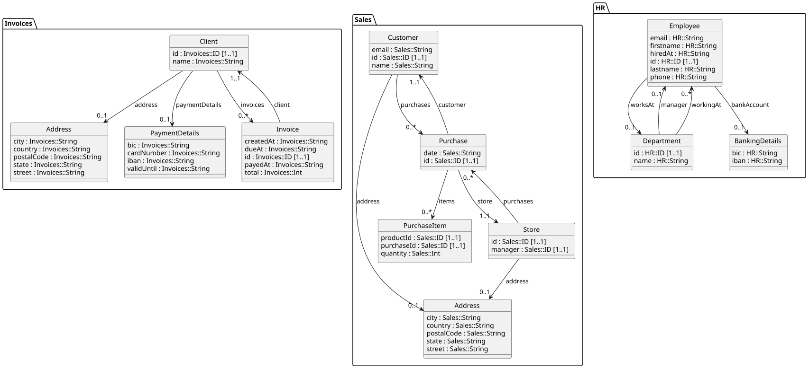

---
title: "Tutorial: GraphQL Federation"
--- 

In this tutorial, you will learn how to implement a _federation_ 
of multiple [GraphQL](https://graphql.org/) web services using CorrLang.

## The Scenario

Let us assume the following scenario:
You are a system's architect at some hypothetical retails company
and have to deal with the following system's landscape
comprising three systems...

- one for storing the purchases of customers, called `Sales`,
- one for storing the invoices that were send to customers, called `Invoices`, and
- one for storing the employee data, called `HR`.

These systems have been developed independently by differnt teams.
At the same time, these systems are not completely isolated from each other. 
In fact, there is what we call _semantic overlap_, which arises that records about the same physical or conceptual 
entities are stored in several of the above systems at the same time.
Upon, inspecting system's data models one may observe that customers are stored in  both `Sales` and
`Invoices` (they are called "clients" there) systems together with their address information.
A common issue that may appear is when customer/clients change addresses and this change is only reflected in one 
of the systems, which results in _inconsistencies_.
Moreover, there might employees from the `HR` system that also are customer/clients.
The management might be interested in _having a report_ how many of the employees are also cutomers in order to determine 
the effects of discounts etc.

Thus, a reasonable first step would be getting an _overview_ of all the data in the individual systems.
In database jargon, such an overview is called a _federation_, i.e. a virtual comprehensive database comprised of independent physical databases.
Yet, we are dealing with web services here, which means that each system appears as a "block-box":
We are able to interact with these systems by sending them messages but we cannot simply "peek inside" directly. 
The pragmatic approach to dealing with this, would be looking for some retrival method ("find all" / GET) in the system's 
GraphQL interface, calling them individually, collecting the results, and finally, assembling the comprehensive data ourselves.


In this tutorial, we will learn how _CorrLang_ can largely automate this process.


## Preliminaries: Getting the Demo Code

To follow along with the example, it is advised to check out the demo code

:::{.border}
<https://github.com/webminz/usecase_SalesInvicesHR.git>
:::

Follow the README instructions in that repository to set up the three Node.js endpoints
by installing the Node.js dependencies and then starting the servers.

```bash
npm install --prefix endpoint1;npm install --prefix endpoint2;npm install --prefix endpoint3
./startup.sh
```

## Exploring the scenario with GraphQL

Assuming, the three endpoints are up and running and accessible at

> <http://localhost:4011> (_Sales_)

> <http://localhost:4012> (_Invoices_)

> <http://localhost:4013> (_HR_)

Go and visit one or all of these URLs!
Each service will offer an interactive GraphQL GUI client, that can be used to explore the system.
If you have never worked with GraphQL, you may quickly read through the introduction on their official website.
Apart from that, it should be pretty easy to get started:
On the left you can write a `query` or `mutation` while specifying the requested response format.
Queries can be directly be executed in the browser by pressing the "play"-button. 
Also, on the right side you can browse to the endpoint's schema, which provides an overview 
of the available service methods as well as the domain model (entities).

Note that by executing a `mutation`, you may actually change the database in that endpoint.
If you want to reset the database to the beginning, you can simply run a `git reset` on the `.sqlite` file.


## Getting started: CorrSpecs and `endpoints`

The first step when using _CorrLang_ is always the creation of a so-called _CorrSpec_.
Thus, it is time to open you favourite text editor and create a new empty file called `spec.corr`
(actually the name nor the ending of this file does not really matter, but we stick with `spec.corr`
as a convention).

Copy or write the following into the new file:

```corrlang
endpoint Sales : SERVICE {
    tech: GRAPH_QL
    url: <http://localhost:4011>

}
endpoint Invoices : SERVICE {
    tech: GRAPH_QL
    url: <http://localhost:4012>
}

endpoint HR : SERVICE {
    tech: GRAPH_QL
    url: <http://localhost:4013>
}
```

Even without having formally introduced the CorrLang DSL grammar, these definitions should hopfully read intuitively.
CorrLang is a _declarative_ language, i.e. the language mostly comprises _declarations_.
The `endpoint` declaration is the first of the three main DSL concepts.
It declares the existence of "something" that shall be _integrated_, _aligned_, _co-related_ etc.
In this example, this type of "something" is a `SERVICE` [^EPTypes], i.e. a system somehow reachable through a local network 
or the internet, which can be interacted with by sending it _messages_.

[^EPTypes]: There are also other types of endpoints in CorrLang. Namely: `DATA`, `SINK`, and `SOURCE`. But these will be 
    addressed in a later chapter.

The endpoint declaration futher comes multiple _directives_, i.e. key-value pairs written as `<directive>: <value>` within the curly braces.
The directives that apply depend on the specific type of endpoint we are dealing with. 
For the SERVICE-endpoint, there must at least be one directive telling _where_ the service is located (expressed by the `url`-directive [^Urls])
and _how_ to talk with that endpoint (expressed by the `tech`-directive).
The latter refers to `GRAPH_QL`, which is the name of a built-in _techspace_ plugin that supports every type of interaction with 
web services based on the GraphQL technology.
Tech spaces are CorrLangs method to address _syntactic interoperability_ by stripping away all the technical details of encoding 
formats, interface description languages, and messaging patterns.

[^Urls]: URL or URI literals are enclosed in angle brackets (`<` `>`). Otherwise, they could also be put in double quotation marks (`"`)
    to demarcate a STRING literal. In general, when using special characters such as `/` , `.`, `:`, `;` and, in general, every 
    non-ASCII character it must be escaped as a STRING.


## Introducing `correspondence`

It is time to extend our CorrSpec and introduce the next declaration concept called `correspodence`.
A correspondence establishes a semantic relationship among two or more endpoints 
and is arguably the most important DSL concept.
Copy or write the following line into your local `spec.corr`.

```corrlang
correspondence Alignment (Sales, Invoices, HR) { }
```

This line simply states that there is _some_ relationships between those endpoints, yet, 
it is not further specified how this relationship actually looks like.
This is done by declaring so-called _commonalities_ within the curly braces.
We will get there in a bit! 
Just let us explore a bit further first.

All CorrLang interactions are performed via the `corrl` CLI, which we, at this point, assume you have already installed 
(see [installation page](./setup.qmd))
Then, make sure that the CorrLang service is installed and running with:

```bash
corrl up
```
Once the service is up and running, we can _apply_ our CorrSpec. 
```bash
corrl apply -f spec.corr
```

The terminal output will now tell you something like `NO actionable items` and you may notice that 
_nothing_ happens...

## Side effects with `views`

But this shall not come as a surprise!
Both `endpoints` and `correspondence` do not actually change anything.
They only describe something that is already there.
If we want something "new" to happen, we will have to define a `view`,
which are CorrLangs "actionable" concepts.

Add the following to your CorrSpec:

```corrlang
view Global(Alignment) : SERVICE {
    schema: ("showcase.puml", PUML);
}
```

You may notice that `view`s resemble `endpoint`s.
This is intentional.
The first major difference are that views need to have a reference to a correspondence,
meaning that this is a _global view_ (federation) based on the correspondence between said endpoints.
The second difference is that the directives within a view-declaration must be thought of as side-effects.
In this case, the `schema`-directive causes the view to output a new file called `showcase.puml`,
which contains a _syntactic presentation_ of the global super-schema (encompassing the indiviudal 
system's schemas) using the `PUML` techspace to encode the information.
The latter is another built-in techspace, which only can be used for output purposes.
It enables visualizations with the help of the [PlantUML](http://plantuml.com) tool. 
You may install the latter now by downloading the `.jar` file from their homepage or copy-pasting PlantUML-code
into the web-based editor.


Ok, let us go ahead by re-running the apply command.
```bash
corrl -f spec.corr
```

This time, the output should be something like:
```
Wrote schema to '.../showcase.puml' using 'PUML'
```
and you will spot the new `showcase.puml` in you working directory.
Use PlantUMl to render this file into a picture, it should look similar to @fig-graphql-showcase.

{#fig-graphql-showcase}

PlantUML was selected as a built-in visualization-specific techspace since it provides a compact visualization 
that is familiar to software practicioners, especially those with an interest in _Model Driven Engineering (MDE)_
As you can see, it provides a nice depcition of the underlying domain models of these three systems, the package namespaces
are used to distinguish the origin of the individual schema elements.

Internally, CorrLang treats all schemas as _graphs_, i.e. _nodes_ and _edges_.
Nodes may further be distinguished to either represent _object types (classes)_ and _value/data types_ (the latter are not explictly rendered by default).
Edges are distinguished into _attribute links_ (connecting object and data types), and _reference links_ (connecting objet types with each other).
These elements have a natural visualization in the form of UML class diagrams.

## A First _Commonality_

The graphic also makes it easier to spot the potential candidates for alignment.
For this use case, we assume that `Customer` in `Sales`, `Client` in `Invoices`, and `Employee` in `HR` should be aligned.
The alignment between elements from different schemas is done via _commonalities_.
In CorrLang there are three types of commonalities: `rel`ations, `sync`hronizations, and `id`entifications.
The latter are arguably the easiest to comprehend. 
The represent that two concepts abtractly are "the same".
Let us try adding one!

Change the definition of the correspondence as follows,

```corrlang
correspondence Alignment (Sales, Invoices, HR) {
    identify (Sales.Customer, Invoices.Client, HR.Employee) as Partner
}
```

and re-run the `corrl apply` to see what happens now.
Re-running PlantUMl should render something like what you see in @fig-partner-integrated.

{#fig-partner-integrated}

As you can see, the `Customer`, `Client` and `Employee` classes have disappeared and have been replaced by the 
new `Partner` class (located in its own namespace taken from the name of the correspondence).
Also, this class now has all the attributes from the original entities and having all references re-routed accordingly.
This is due to the fact that an identification intuitively means "gluing" together all the nodes representing the 
original object types.

The visualization also indicates that there are some redundancies w.r.t. attributes of the new merged entity since there 
are multiple `email`, `id`, and `name` attributes. 
Let us try to merging an attribute. 

```corrlang
correspondence Alignment (Sales, Invoices, HR) {
    identify (Sales.Customer, Invoices.Client, HR.Employee) as Partner
    identify (Sales.Customer.id, Invoices.Client.id, HR.Employee.id) as id
}
```

Thus, merging of object types and attributes syntactically does not differ from each other in the CorrLang DSL.
Every `id`-commonality declaration follows the same patterns: First, the keyword `identify` followed 
by _references_ to the schema elements that should be identified.
A reference is defined as a _path expression_, where the individual segments are seperated by dots (`.`).
Each path expression has to start with the name of the endpoint, followed by a path of identifiers locating 
indiviudal objects inside the schema, i.e. object types are directly followed on top-layer of the endpoint schema 
while attributes have to be prefixed with the name of the type they are starting from. 
Try re-applying the CorrSpec now, you will see the following:

```
Cannot find preimage commonality for ID
```

This error message most likely will sound rather cryptic.
Let me explain it here: An attribute is internally represented as an edge that connects a object type node with 
a data type node. 
In order to identify two or more edges with each other, they have to start at the same node and end at the same node.
Right now, the the three `id`-edges start at the same `Partner`-node but they end at different data type nodes, namley
the `ID` data type node in `Sales`, `Invoices` and `HR` respectively.
Thus, we need to make sure to identify them as well:

```corrlang
correspondence Alignment (Sales, Invoices, HR) {
    identify (Sales.ID, Invoices.ID, HR.ID) as ID
    identify (Sales.Customer, Invoices.Client, HR.Employee) as Partner
    identify (Sales.Customer.id, Invoices.Client.id, HR.Employee.id) as id
}
```
With these changes, the view generation will not complain anymore and upon inspecting the newly generated visualization,
you will see that the three-doubled `id` is disappeared, yet, there are some more reundant attributes.

Now, **as an exercise**: Try to identify those attributes by adding the respective declarations on your own!
Also: you may discover that the `Address` entities in `Sales` and `Invoices` are basically "the same".
Try identify them as well.

## Technical Refinements

We now have achieved some conceptual alginment among the schema elements.
However, we have not produced anything useful, only a graphical depcition of a unified schema.
In order to change this, we start by adding another `schema`-directive in the `view`-declaration.
As for the `tech`-space, we are choosing `GRAPH_QL` this time in order to produce the resulting 
GraphQL schema for the federated endpoint we are trying to create.


```corrlang
view Global(Alignment) : SERVICE {
    schema: ("showcase.puml", PUML);
    schema: ("globalSchema.graphql", GRAPH_QL)
}
```
Applying this CorrSpec, we are being greeted with another error message:

```
There are more than one 'query' container objects (|Sales|.Query, |HR|.Query, |Invoices|.Query). In GraphQL, there must be only **one**! Consider identifying these types!
```

You might be wondering: What `Query` is CorrLang talking about?
This is because, so far, GraphQL has only been showing us an excerpt of the service schemas.
Thus, modify the view declarations as follows:

```corrlang
view Global(Alignment) : SERVICE {
    schema: ("showcase.puml", PUML, {"depictActions": "facade"})
    schema: ("globalSchema.graphql", GRAPH_QL)
}
```

Directives may be given arbitrary key-value-pairs (encoded as JSON) that gets passed 
on to the underlying tech space. 
In this case, the PlantUML tech space offers an option to steer the depiction of so-called 
_action_ elements in the schema. 
Schemas therefore do not only contain object types, data types, attributes and references but 
also action types, action type groups, and arguments.
Action types represent a reification of the possible requests that one may send to a service endoint. 
They can be organised in groups and link to the remaining schema elements via _inputs_ (arguments) 
and _outputs_ (results).
By default, the PlantUML schema visualizer does not show these elements (`{"depictActions": "none"}`)
but setting it to `facade` will render the action type groups as "facade" classes and actions as methods.
The intepretation of what is considered an action type strongly depends on the underlying technology. 
In the case of GraphQL, we intepret the fields of the special `Query` and `Mutation` types as 
the actions.
Try re-rendering the PlantUML class diagram now, you will show the action elements.

Action elements in the schema can also be semantically aligned just as before.
Hence, we can get rid of the previous error messages:

```corrlang
correspondence Alignment (Sales, Invoices, HR) {
    ...
    identify (Sales.Query, Invoices.Query, HR.Query) as Query
    identify (Sales.Mutation, Invoices.Mutation, HR.Mutation) as Mutation
    ...
}
```

As you might see, CorrLang now will generate the expected `globalSchema.graphql` file,
which defines a GraphQL schema unifying all of three existing systems.
Yet, nothing else is happening. 
It would be nice if we somehow could interact with this virtual federated systems.
For this, add a new line to the view declaration.

```corrlang
view Global(Alignment) : SERVICE {
    tech: GRAPH_QL
    schema: ("showcase.puml", PUML, {"depictActions": "facade"});
    schema: "globalSchema.graphql"
    url: <http://127.0.0.1:9090/>
}
```

We have already seen the `url` directive in use with endpoint declarations.
If we place this directive on a view, we instruct CorrLang to spin up 
a proxy on the specified port and network interface that acts as the virtual federated endpoint.
When re-applying the spec, you will now see something like 

```
Is listening on ...
```

That means that the GraphQL service is running.
You can test whether this "new" endpoint is working by sending a GraphQL POST request to <http://127.0.0.1:9090/graphql>,
e.g., you can connect the GraphQL GUI from the beginning to this new address and try sending some 
requests such as retrieving all `customers`, `clients` or `employees`.
You will see that each of the original requests also works against the federated endpoint.

## Action identification

Until now, we have created a federated GraphQL endpoint with an integrated schema that is able to re-lay incoming requests.
However, from an operational perspective, we have not much new now.
We can call each of the original endpoints alone via this new interface but we are not getting data from
all endpoints simultaneosly, yet.
We want to change this. 
And the straightforward way to do this is by identifying the actions itself.
The way for doing this, should not come as a surprise anymore.
Let us assume, we want to synchronize the operations that retrieve all the `customers`, `clients`
and `employees`. 
Naturally, we call this operation `partners`.

```corrlang
correspondence Alignment (Sales, Invoices, HR) {
     ...
     identify (Sales.Query,Invoices.Query,HR.Query) as Query with {
        identify (Sales.Query.customers, Invoices.Query.clients, HR.Query.employees) as partners
     }
     ...
}

```

Re-apply the specification and test it out by sending the following GraphQL query:
```graphql
query {
    partners { 
        id 
        email
        purchases { id }
        invoices { id } 
        worksAt { name }
    }
}
```


:::{.callout-caution}
under construction ...
