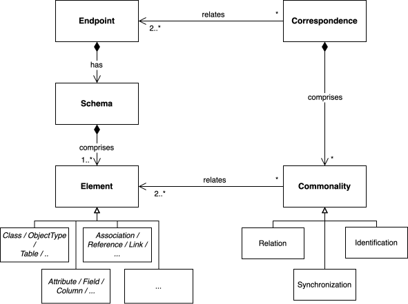
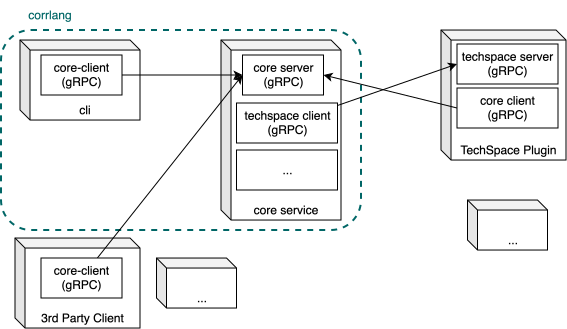

--- 
title: Introduction 
bibliography: Corrlang.bib
---

# What is CorrLang ?

> **TL;DR** A _domain specific language (DSL)_ and tool for managing _semantic interoperability_ through the 
> declaration of relationships between _concepts_.


## History


The idea for _CorrLang_ came into place some time during the late stages of my PhD [@MYPHD].
At that time, I was mostly working with quite theoretical formal mathematical stuf: 
category theory and algebraic graph transformation.
I wanted to supply this rather abstract work with something more tangible, which I could show to my 
more applied software peers[^1].

[^1]: Also it was a nice "side hustle" while wading through the tough phase of my Ph.D. thesis writeup.

### The Beginning: graphqlintegrator

The starting point for CorrLang was a "side project" called [graphqlintegrator](https://gitlab.com/olevonbargen/graphqlintegrator), 
developed by the very first master student, which I was supervising: _Ole von Bargen_.
This tool was also presented in a paper at [ECMFA](https://conf.researchr.org/series/ecmfa) [@StuenkelBargenRL2020],
and could be considered the technical and conceptual ancestor of CorrLang.
It facilitated a _federation_ [@amraniSurveyFederativeApproaches2024] of multiple GraphQL endpoints via _query rewriting_.
A federation is a conceptual system made up of multiple physical systems appearing as one from the outside.
A common use case for a federation is in databases.
The rewriting algorithm used in the tools was theoretically inspired by the _colimit concept_ [@goguenCategoricalFoundationsGeneral1973] 
(i.e., first creating a common "global" schema
by collecting all schema elements into one and then identifying elements that are considered to be "the same").
The tool also featured a DSL, which was used to specify _what_ GraphQL schema element shall be identified and when.
Hence, this DSL was a first draft of the semantic interoperability language that CorrLang is today.
Graphqlintegrator was useful for sketching out first ideas and playing around with the query rewriting concept.
However, it was more of a protype rather than something you would run in production.
Moreover, it was "locked-in" on the colimit-concept and therefore not perfectly suitable to express all kinds 
of semantic interoperability problems (as I have been discovering throughout my PhD on a more theoretical level).

### Consolidation: CorrLang v0.9

Therefore, in 2021, I started a re-implementation, based on the concepts in graphqlintegrator.
This time, it was built from a more foundational perspective, incorporating our previously published idea of _comprehensive systems_ [@StuenkelKoenigLR2021a]. 
The latter is an abstract framework, heavily built upon concepts from category theory, which 
might make reading the paper quite cumbersome for those who are not already familiar with this abstract branch 
of mathematics. 
The general idea, however, can be sketched out quite intuitively:

- software models (this can be schemas, data models, interface description langauages but also instances a.k.a. _data sets_)
  can abstractly be described as _graphs_, i.e. _classes/concepts/objects_ are considered as _nodes_ while _references/associations/links_
  are considered as _edges_.
- relationships (e.g. _typing/instanceOf_) between such models (think graphs) can be expressed by something called _graph (homo-)morphisms_,
  i.e. a mapphing that respects the edge-node-incidence.
- graph morphisms are generally _directed_ and _binary_. Therefore, they are not directly adequate for expressing semantic 
  interoperability relationships among concepts from separate models because such relationships (e.g. "same-ness") are generally _undirected_ 
  and _multi-ary_.
- semantic interoperability relationships can be expressed via _spans_ (formally: a star-shaped structure of multiple partial morphisms),
  which can be thought of as generalized relations: They can be drawn on a whiteboard as lines (or "tentacles") with many ends that put nodes 
  or edges from multiple graphs in relationship with each other.
- What we have show in our paper was that this span-structure actually can be "_internalized_" (flattened) such that the resulting 
  structure is "basically" a graph again. Hence, we only ever need to work with graphs (with the small caveat that we 
  have to put some special attention on some edges). 

CorrLang was meant as a showcase to put these ideas into action. 
With the delivery of my thesis sometime in September 2021, _version 0.9_ of CorrLang was ready.
Until recently, this version was the "official" showcase version that was linked on the website for a long time.
It is also the version that is described in chapter 6 of my thesis. 
This version re-implemented the functionality of graphqlintegrator in the more general framework of _comprehensive systems_
and came with a more "polished" DSL. 
The main concepts of the DSL remain valid also in the newest version and are depicted in @fig-corrlang-domain.

{#fig-corrlang-domain}

The basic building blocks are `endpoints`.
These can be servers, databases or simple files.
Each endpoint must have a `schema` which describes it by listing the "entities", "operations", "data types" etc.
In CorrLang, those are called `elements` and as we have just learned, they are abstractly considered to be nodes and edges
in a graph formally representing the schema.
Endpoints may be built upon various technologies, e.g., a file written in XML, a service offering a HTTP/REST interface, 
an SQL database, or more "exotic" technologies like RDF etc.
I consider the handling of this heterogeneity as an issue of _syntactic interoperability_ and I assume it is solvable
by butting the necessary amount of effort into it.
Therefore, CorrLang introduces the concept of a `techspace`.
This term, originally, stems from one of the original papers on the model transformation language ATL [@bezivinFirstExperimentsATL2003]
which considers demarcated ecosystems of interoperable formats and tools.
In CorrLang, a `techspace` is basically a _plugin_ that knows how to interact with such a technological ecosystem, i.e.,
it is able to parse or write scehmas and data, call services, etc., depending on the respective technological space.
Thus, a `techspace` performs the translation between a concrete technological encoding and CorrLang-internal graph-based formal 
representation.
The original CorrLang version come with exactly two built-in `techspace` plugins:
One for GraphQL (in order to encompass the behaviour of the graphqlintegrator predecessor) and 
the _Eclipse Modeling Framework (EMF)_, which was the "go-to"-platform for a lot of academic tools in the 
are of _Model-Driven Software Engineering (MDSE)_ at that time.


Among a set of endpoints (at least two), one may define a `correspondence`, which means that these endpoints share
some semantic `commonalities`.
The latter reify the correspondence via concrete relationships among the schema elements.
Commonalities can be of different types.
One of them being `identity` (i.e. two or more elements in disparate schemas representing the same concept),
which is a very strong form of a commonality.
Another form is the generic `relation`, which can be used to express any kind of semantic relationship. 
The idea is that one could attach some constraints to these relationships to encode inter-model consistency rules. 
A very common form of inter-model constraints are constraints of the form "for every X in model A there shall be a 
corresponding Y in model B and vice versa".
We call these `synchronization`-rules and they can be though of as a special type of `relation`-commonalities that come with 
a built-in constraint. 
These rules are, for instance, heavily studied in the _bidirectional transformation (bx)_ scientific community.
All of these concepts were reified in the first draft of the CorrLang DSL.

```corrlang
correspondence Backoffice (Sales, Invoices, HR) { 
	# (1) merges types/attributes/associations 
	identify (Sales.Customer, Invoices.Client, HR.Employee) as Partner;
	# (2) introduces new associations
	relate (Sales.Purchases, Invoices.Invoice) via paidIn; 
	# (3) introduces new associations and automatically keeps them consistent
	sync (Sales.Customer.address, Invoices.Client.address);	 
}
```

As it shown, the language is purely declarative and the definition of endpoints and correspondences with their 
commonalities has no effect per se (apart from the added value of having explicit documentation).
In order to have some _actionable_ items in the language, the `0.9` version of CorrLang had a concept of `goals`.
The latter being a pre-defined list of common operations that one may perform during semantic model interoperability 
management:

- Creating a global (i.e. merged) view of the system schema
- Performing a global consistency check, and 
- Creating a _federated system_ out of individual systems.

On youtube, there still exists an old screencast that demonstrates how to create a federation of 
of multiple GraphQL endpoints[^oldScreencast]:



[^oldScreencast]: The new version adjusted for the current CorrLang version is now found in the [Tutorial](./graphql-tutorial.qmd).


### The road to v1.0

After defending my PhD in February 2022, the usual thing happened: I got a new position somewhere else 
and then development halted. 
At this point, CorrLang would have gone the same road as all academic software prototypes, which are developed 
as part of master or PhD theses: They disappear.
Thankfully, I got the opportunity to continue in academia in a permanent position.
The latter came with a lot of teaching duties, organisational stuff, politics, supervision, and other competing research directions [^acedemicSeniority].
Thus, even though me having having a lot less time than before, the amount of time available to work on CorrLang is greater than zero.
Moreover, there is the occasional opportunity of having development support through (master) student projects and the prospect of 
the availability of increasingly powerful coding LLM-assistants, I am motivated to turn _CorrLang_ into a somewhat more stable product.
Since 2025, I have been working on a major revision of the codebase.

[^acedemicSeniority]: The natural development seems to be that with growing academic "seniority", one is working 
    with much more topics than before, but each of them on a far more superficial level.

The major changes compared to the previous version are as follows:
- The concept of `goal`s was dropped and replaced with the more general concept of a `view`.
  This means that instead of having a set of ad-hoc defined model management operations that are configurable via 
  the DSL, now, there is the unified concept of a `view`, which represents the reification of a correspondence into 
  a single artifact. In such way, the schema merging and service federation operations can be expressed through the same concept.
- The internal software architecture was completely reworked to make _CorrLang_ less dependent on a single 
  programming language. The central codebase with the custom comprehensive system logic from the previous version 
  is still written in Java. But it's public API (called `core-service`) was encapsulated and made avaialble via gRPC.
  Thus, the general system architecture became more modular and it is now possible to develop `techspace`-plugins 
  in other technologies too[^javaPlugins] than Java: A `techspace`-plugin can be a service that communicates with the `core-service`
  through a gRPC interface. Likewise, one may develop different _clients_ that interact with CorrLang. 
  In such way, we could re-implement the CorrLang command line interface was an independent native application written in Go.
  This architecture is illustrated in @fig-corrlang-arch.
- The DSL was revised once more to account for the new concept of `views` and some "streamlining" with respect to 
  the definition of endpoints and their properties. The following code listing provides an impression of the current 
  state of the DSL.

```corrlang
endpoint Webservice : SERVICE {
    tech: OPENAPI
    url: <https://www.example.com/api/v.2/swagger.json>
}

endpoint Dataset : DATA {
    tech: XML 
    schema: <http://www.example.com/schemas/domainmodel.xsd>
    file: "testdata/data.xml"
    dir: ("testdata/files/", "*.xml", recursive)
}

correspondence Correspondence (Webservice, Dataset) {
    identify (Webservice.string, Dataset.string) as string
    identify (Webservice.User, Dataset.Customer) as ClientEntity with {
        identify (Webservice.User.id, Dataset.Customer.customer_id) as id
        synchronize (Webservice.User.email, Dataset.Customer.email_address)
    }
    synchronize (Webservice."/users".GET, Dataset.Customer.all)
}

view SchemaView (Correspondence) : DATA  {
    tech: PUML
    schema: "rendering.puml"
}

view AugmentedWebservice (Correspondence) : SERVICE {
    tech: OPENAPI
    url: <http://0.0.0.0:9000>
}
```
{#fig-corrlang-arch}

[^javaPlugins]: Plugins can still be developed in Java. In this case, plugins are packaged into `.jar` files 
    and put on the `core-service` CLASSPATH. They are discovered in code through the `ServiceLoader`-interface.

You can follow the roadmap to version 1.0 [directly on Codeber](https://codeberg.org/drstrudel/corrlang/milestone/86295)


### References 

:::{#refs}
:::
